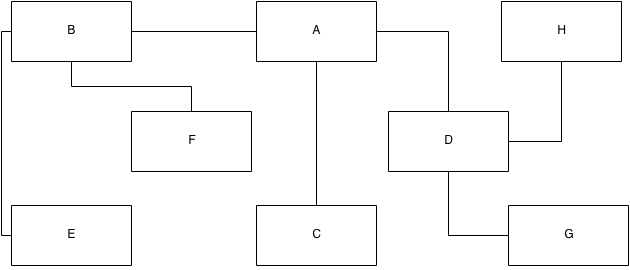
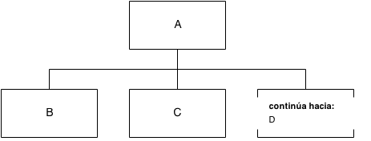

% Vocabulario visual para arquitectura de información y diseño de interacción

# Consideraciones iniciales

---

Un vocabulario visual es **un conjunto de símbolos usado para describir algo** (usualmente un sistema, estructura o proceso; en nuestro caso, un sitio web).

---

### Debería ser: 

>* Compatible con pizarra blanca. Tan simple que los diagramas puedan ser dibujados rápidamente a mano.
>* Independiente de herramientas. No requerir de software especializado.
>* Pequeño y auto-contenido. El total de los elementos debe ser mantneido al mínimo posible, manteniendo una estricta relación uno a uno entre conceptos y símbolos, para que el vocabulario pueda ser aprendido y aplicado de forma rápida.

# Elementos simples

---

### Páginas, documentos y pilas

La **página** es la unidad básica \
de la experiencia de usuario en la web.

Además de páginas, también podemos tener archivos o **documentos**, o _parcelas de datos sin propiedades de navegación_. Estos archivos son entregados al usuario para su uso fuera de un navegador web.

---

---

Las pilas de páginas o documentos se utilizan para indicar un grupo de elementos con las mismas funcionalidades y con el mismo acceso a través de la navegación, que pueden ser clasificadas como una entidad única (una colección de manuales de instrucciones en PDF, por ejemplo).

---

--- 

Usamos **etiquetas** en páginas y archivos para identificarlos. No hace falta que se correspondan exactamente con los títulos finales, pero sí es importante que sean un identificador único.

---

### Relaciones: conectores y flechas

Las relaciones entre elementos se indican mediante líneas simples o conectores (con flechas). Es importante recordar que, aunque todas estas relaciones se traducirán en relaciones de navegación, **no todas las relaciones de navegación aparecerán en el diagrama**.  

relación &ne; navegación

---

---

---

Cuando diagramamos diseño de la interacción, las líneas también deben indicar dirección para especificar cómo se moverá el usuario a través del sistema para una tarea específica. 

. . . 

Esto puede hacerse utilizando flechas, sin que la direccionalidad impida al usuario moverse en el sentido opuesto.

---

. . . 

---

--- 

Los conectores y flechas también se pueden etiquetar, pero sólo en el caso de que sea imprescindible. Si las etiquetas son largas, son muchas y/o comienzan a sobrecargar el diagrama, se puede apuntar al lector hacia una nota al pie o una referencia en un anexo.

--- 

 

---

 

---

---

### Conjuntos concurrentes

Se usan cuando una acción del usuario genera resultados múltiples simultáneamente, como abrir una ventana pop-up mientras se carga otra ventana en la página principal, o mostrar una página mientras se descarga un documento.

---

---

### Puntos de continuación

Permiten separar el diagrama en conjuntos que sean fáciles de comprender y asimilar.

---

. . . 

---

### Elementos comunes: áreas y áreas iterativas {#areas}

Las áreas identifican un grupo de páginas que comparten uno o varios elementos comunes (que deberían ser identificados por etiquetas).

---

---

También puede ocurrir que queramos repetir la misma estructura básica porque se aplica a una serie de elementos funcionalmente idénticos (como un catálogo de productos con varias páginas asociadas a cada uno). 

---

---

Los conectores y flechas no apuntan al área, que sirve solamente para encerrar una serie de páginas. 

---

### Componentes reutilizables: áreas de flujo y referencias

Algunos diseños de interacción requieren una secuencia de pasos que se repita en diferentes contextos (como un procedimiento de login, por ejemplo). Estas tareas reutilizables se denominan flujos (_flow_), y se representa en el diagrama mediante dos elementos:

* el área de flujo, que encierra el flujo mismo, y
* la referencia de flujo, que sirve para identificarlo.

---

---

---

Las áreas de flujo funcionan de manera muy similar a los puntos de continuación. La diferencia es que una referencia de flujo puede utilizarse como _continúa desde_ y _continúa hacia_, mientras que un punto de continuación sólo puede ser una cosa o la otra.

# Elementos condicionales

----

En una estructura dinámica, el sistema decide qué opciones y resultados se le presentan al usuario en función de una o más condiciones (relativas al usuario, a la sesión, el contenido mismo, o de otro tipo).

Generalmente, para simplificar la visión de los diagramas, las condiciones se describen en notas al pie o anexos.

---

### Puntos de decisión {#pdec}

Cuando una acción del usuario puede generar uno de varios resultados (como por ejemplo, un error tras el envío de un formulario), el sistema debe _decidir_ qué resultado presentar. 

---

---

### Conectores y flechas condicionales

Cuando existen caminos que se presentan al usuario dependiendo de si se cumplen una o más condiciones. Por ejemplo, información visible sólo para usuarios logueados.

---

---

### Ramas condicionales {#rcond}

Cuando se debe seleccionar una serie de opciones mutuamente excluyentes. 

Es parecido a los [puntos de decisión](#pdec) pero se diferencia en que en este caso el sistema decide la opción que se mostrará al usuario antes de que éste realice ninguna acción. 

No es fácil encontrar ejemplos de este tipo de elemento.

---

---

### Selectores condicionales

Es parecido a las [rama condicionales](#rcond) salvo que en este caso las opciones **no** son mutuamente excluyentes; se le presentan al usuario todas las opciones que respondan a las condiciones establecidas.

. . . 

La aplicación más común son los resultados de búsqueda. 

---

---

### Racimos

Los racimos (más de un camino basado en ciertas condiciones) aparecen después de una [rama condicional](#rcond) o un [selector condicional](#scond).

También resulta difícil encontrar ejemplos en la vida real.

---

---

### Áreas condicionales

Cuando se aplican una o más condiciones a un grupo de páginas, se encierran en un área condicional. 

Se usan generalmente para situaciones que requieren permisos de acceso (como un login o conexiones seguras). 

A diferencia de [otros tipos de áreas](#areas), se asocian con un resultado que se generará en el caso de que no se cumplan las condiciones para el acceso a ese área.

---

# Para terminar

--- 

* Guías de referencia rápida: [cheatsheet](docs/garrett_ia_cheatsheet.pdf) y [quickref](docs/garrett_ia_quickref.pdf)
* Ejemplo [MetaFilter](http://www.metafilter.com/), [IA de ejemplo](docs/metafilter_ia.pdf)
* Aplicaciones online: [Gliffy](http://www.gliffy.com), [draw.io](http://draw.io)